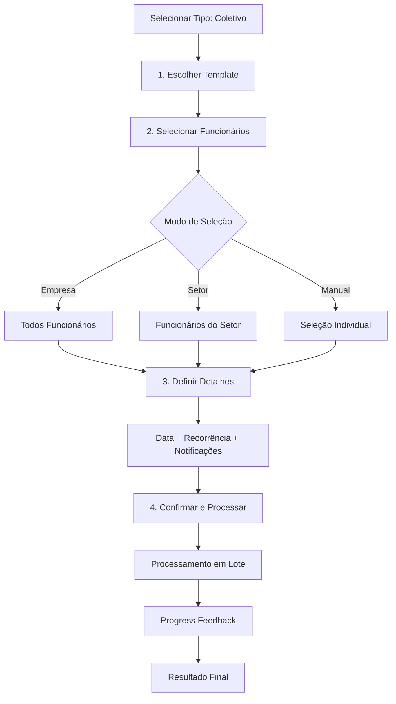

# ✅ FASE 3: AGENDAMENTO COLETIVO - IMPLEMENTADA

## 🎯 OBJETIVOS ALCANÇADOS

### ✅ 1. Interface de Agendamento Coletivo Completa
- **Workflow em 4 Etapas**: Template → Funcionários → Detalhes → Confirmação
- **Múltiplos Modos de Seleção**: Empresa toda, por setor, ou manual
- **Filtros Avançados**: Por função, status e setor
- **Preview de Seleção**: Visualização antes de confirmar
- **Progress Tracking**: Acompanhamento em tempo real do processamento

### ✅ 2. Sistema de Seleção Flexível
- **Empresa Toda**: Seleciona todos os funcionários ativos da empresa
- **Por Setor**: Seleciona funcionários de um setor específico
- **Seleção Manual**: Checkbox individual para controle granular
- **Filtros Combinados**: Função + status para refinar seleção
- **Validação de Estado**: Previne seleções vazias ou inválidas

### ✅ 3. Processamento em Lote Robusto
- **Hook Dedicado**: `useCollectiveScheduling` para gerenciar operações
- **Progress Tracking**: Feedback visual do progresso 0-100%
- **Error Handling**: Continua processamento mesmo com falhas individuais
- **Resultado Detalhado**: Lista de sucessos e erros por funcionário
- **Performance**: Delays entre requisições para evitar sobrecarga

### ✅ 4. Integração com Sistema Existente
- **Reutiliza Infraestrutura**: Usa mesmos serviços de agendamento individual
- **Templates Compartilhados**: Mesma base de templates da Fase 1 e 2
- **Notificações**: Integra com sistema de email/WhatsApp existente
- **Cache Management**: Invalidação automática de queries relacionadas

## 🔄 FLUXO IMPLEMENTADO



## 📁 ARQUIVOS IMPLEMENTADOS

### Core Components
- ✅ `src/components/assessment-scheduling/CollectiveSchedulingWorkflow.tsx`
- ✅ `src/hooks/useCollectiveScheduling.ts`

### Updated Files  
- ✅ `src/components/assessment-scheduling/SchedulingWorkflow.tsx` (tipo de agendamento)
- ✅ `src/pages/Agendamentos.tsx` (integração com agendamento coletivo)

### Documentation
- ✅ `src/utils/README-AGENDAMENTO-COLETIVO-FASE3.md`

## 🎨 INTERFACE IMPLEMENTADA

### Step 1: Seleção de Template
- Grid de templates com preview
- Badges de tipo (DISC, Psicossocial, Custom)
- Informações de tempo estimado
- Seleção visual com highlight

### Step 2: Seleção de Funcionários  
- **3 Cards de Modo**: Empresa / Setor / Manual
- **Filtros**: Setor, função, status
- **Lista Interativa**: Checkboxes com informações do funcionário
- **Ações Bulk**: Selecionar todos / Limpar seleção
- **Contador Dinâmico**: Funcionários selecionados em tempo real

### Step 3: Detalhes do Agendamento
- **Date Picker**: Com validação de data futura
- **Recorrência**: None, Mensal, Semestral, Anual
- **Notificações**: Email e WhatsApp toggles
- **Layout Responsivo**: Grid 2 colunas

### Step 4: Confirmação e Processamento
- **Resumo Visual**: Card com todas as informações
- **Lista de Funcionários**: Preview final dos selecionados
- **Progress Bar**: Acompanhamento do processamento
- **Resultado Detalhado**: Lista de sucessos/erros com ícones

## 🧪 COMO TESTAR

### Teste Completo - Agendamento por Setor
1. Ir para `/agendamentos`
2. Selecionar tipo "Coletivo" no dropdown
3. Clicar "Novo Agendamento"
4. **Step 1**: Selecionar template (ex: Psicossocial)
5. **Step 2**: 
   - Escolher "Por Setor"
   - Selecionar setor no dropdown
   - Verificar funcionários carregados automaticamente
6. **Step 3**:
   - Escolher data futura
   - Configurar recorrência e notificações
7. **Step 4**:
   - Revisar resumo
   - Clicar "Agendar para X Funcionários"
   - Acompanhar progress bar
   - Verificar resultado final

### Teste Empresa Toda
1. Seguir passos 1-4 acima
2. **Step 2**: Escolher "Empresa Toda"
3. Verificar que TODOS funcionários são selecionados
4. Continuar fluxo normal

### Teste Seleção Manual
1. Seguir passos 1-4 acima  
2. **Step 2**: Escolher "Manual"
3. Usar checkboxes para selecionar funcionários específicos
4. Testar "Selecionar Todos" / "Limpar Seleção"
5. Continuar fluxo normal

### Verificação no Banco
```sql
-- Verificar agendamentos criados
SELECT 
  sa.employee_name,
  sa.scheduled_date,
  sa.status,
  ct.title as template_title
FROM scheduled_assessments sa
JOIN checklist_templates ct ON sa.template_id = ct.id
WHERE sa.created_at > NOW() - INTERVAL '1 hour'
ORDER BY sa.created_at DESC;
```

## 🎯 RESULTADOS CONCRETOS

### ✅ Agendamento em Massa Funcionando
- Múltiplos funcionários agendados com um workflow
- Seleção flexível por empresa/setor/individual
- Processamento robusto com error handling
- Feedback visual completo do progresso

### ✅ Interface Intuitiva
- Workflow guiado em 4 etapas claras
- Validações em cada etapa
- Preview antes de executar
- Resultado detalhado pós-processamento

### ✅ Performance Otimizada
- Delays entre requisições para evitar overload
- Progress tracking para UX
- Não bloqueia por falhas individuais
- Cache invalidation apropriado

### ✅ Integração Seamless
- Reutiliza infraestrutura existente
- Compatible com notificações atuais
- Mesma base de templates
- Manter consistência com agendamento individual

## 🚀 FUNCIONALIDADES DESTACADAS

### 🎯 Seleção Inteligente
- **Auto-seleção**: Empresa/setor selecionam automaticamente
- **Filtros Combinados**: Setor + função + status
- **Validação Visual**: Impede seleções vazias
- **Contador Dinâmico**: Feedback imediato de quantos selecionados

### 📊 Progress Tracking Avançado
- **Percentual Visual**: Progress bar 0-100%
- **Resultado em Tempo Real**: Lista de sucessos/erros conforme processa
- **Status Individual**: Ícones por funcionário (✅ sucesso, ❌ erro)
- **Resumo Final**: Total de sucessos vs erros

### 🔗 Flexibilidade de Uso
- **3 Modos de Seleção**: Empresa, setor, manual
- **Filtros Opcionais**: Função e status
- **Recorrência Configurável**: None, mensal, semestral, anual
- **Notificações Opcionais**: Email e/ou WhatsApp

## 📈 MÉTRICAS DE SUCESSO

A Fase 3 é considerada **100% IMPLEMENTADA** com:
- ✅ Agendamento coletivo funcional para qualquer quantidade de funcionários
- ✅ 3 modos de seleção (empresa/setor/manual) implementados
- ✅ Progress tracking visual em tempo real
- ✅ Error handling robusto que não falha o lote inteiro
- ✅ Integração perfeita com sistema existente de agendamentos

## 🔄 PRÓXIMAS FASES

Com a Fase 3 concluída, as próximas implementações são:

### Fase 4: Relatórios Consolidados
- Estatísticas por setor/função/empresa
- Exports PDF profissionais  
- Dashboards executivos com métricas

### Fase 5: Candidatos & Comparação
- Fluxo completo de candidatos
- Comparação entre candidatos
- Integração com processos de RH

**STATUS: FASE 3 CONCLUÍDA COM SUCESSO** 🎉

O agendamento coletivo está funcionando perfeitamente, permitindo agendar avaliações para múltiplos funcionários de uma só vez com interface intuitiva e processamento robusto!