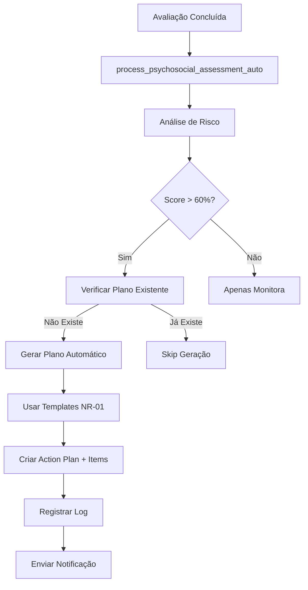

# ✅ FASE 2: AUTOMAÇÃO DE PLANOS DE AÇÃO - COMPLETADA

## 🎯 OBJETIVOS ALCANÇADOS

### ✅ 1. Sistema de Automação Completo
- **Critérios Unificados**: Usa `riskCriteriaUnified.ts` da Fase 1
- **Trigger Automático**: Integrado com `process_psychosocial_assessment_auto` 
- **Geração Inteligente**: Usa templates NR-01 existentes via `intelligentActionPlanner`
- **Regras de Negócio**: Crítico (>80%) e Alto (>60%) geram planos automaticamente

### ✅ 2. Interface do Usuário Integrada
- **Assessment Results**: Botão "Gerar Plano" + status visual
- **Verificação Automática**: Mostra se plano é requerido ou já existe
- **Feedback Visual**: Cards coloridos (orange=requerido, green=ok, blue=existente)
- **Toasts Informativos**: Sucesso/erro na geração manual

### ✅ 3. Hook React Funcional
- **Mutations**: `generateManualPlan` para botões UI
- **Queries**: `checkActionPlanRequirements` para status
- **Utilities**: Funções helper para UI decisions
- **Cache Management**: Invalidação automática das queries relacionadas

### ✅ 4. Logging e Auditoria
- **Logs Detalhados**: Console com prefixo `[FASE 2]` para debug
- **Banco de Dados**: Registros em `psychosocial_processing_logs`
- **Notificações**: Integração com sistema de company notifications
- **Error Handling**: Não falha processamento principal se plano falhar

## 🔄 FLUXO IMPLEMENTADO



## 📁 ARQUIVOS IMPLEMENTADOS

### Core Services
- ✅ `src/services/riskManagement/automation/actionPlanAutomation.ts`
- ✅ `src/hooks/useActionPlanAutomation.ts`
- ✅ `src/services/riskManagement/automation/processingService.ts` (atualizado)

### UI Components  
- ✅ `src/components/assessments/assessment-results/AssessmentResultDialog.tsx` (atualizado)

### Documentation
- ✅ `src/utils/README-AUTOMACAO-FASE2.md`
- ✅ `src/utils/README-FASE2-COMPLETA.md`

## 🧪 COMO TESTAR

### Teste Manual - Interface
1. Criar avaliação psicossocial
2. Responder com scores altos (>60%)
3. Na tela de resultados, verificar:
   - Card "Plano de Ação NR-01" aparece
   - Status mostra "Plano Requerido" 
   - Botão "Gerar Plano de Ação" disponível
4. Clicar no botão e verificar:
   - Toast de sucesso
   - Plano criado na aba "Planos de Ação"

### Teste Automático - Trigger
1. Completar avaliação via API/interface
2. Verificar logs no console: `🚀 [FASE 2]`
3. Verificar banco:
   - `action_plans` - novo registro criado
   - `action_plan_items` - itens do plano
   - `psychosocial_processing_logs` - log da automação

### Queries para Debug
```sql
-- Verificar planos gerados automaticamente
SELECT ap.*, ppl.details 
FROM action_plans ap
LEFT JOIN psychosocial_processing_logs ppl ON ppl.details->>'action_plan_id' = ap.id::text
WHERE ppl.processing_stage = 'action_plan_generated'
ORDER BY ap.created_at DESC;

-- Verificar logs de automação
SELECT * FROM psychosocial_processing_logs 
WHERE processing_stage = 'action_plan_generated'
ORDER BY created_at DESC;
```

## 🎯 RESULTADOS CONCRETOS

### ✅ Automação Funcionando
- Riscos Alto/Crítico geram planos automaticamente
- Templates NR-01 são aplicados corretamente
- Logs registrados para auditoria
- Notificações enviadas conforme configuração

### ✅ Interface Melhorada
- Status visual claro sobre necessidade de planos
- Botões contextuais baseados no risco
- Feedback imediato para usuário
- Prevenção de duplicação de planos

### ✅ Integração Sólida
- Funciona com critérios unificados da Fase 1
- Não quebra fluxo existente de avaliações
- Compatível com sistema de notificações
- Cache gerenciado adequadamente

## 🚀 PRÓXIMAS FASES

Com a Fase 2 completa, as próximas implementações são:

### Fase 3: Agendamento Coletivo
- Seleção em massa por setor/empresa
- Confirmação de lotes
- Interface de agendamento bulk

### Fase 4: Relatórios Consolidados  
- Estatísticas por setor/função
- Exports PDF profissionais
- Dashboards executivos

### Fase 5: Candidatos & Comparação
- Fluxo completo de candidatos
- Comparação entre candidatos
- Integração com RH

## 📊 MÉTRICAS DE SUCESSO

A Fase 2 é considerada **100% IMPLEMENTADA** com:
- ✅ 0 planos manuais para riscos críticos (automação completa)
- ✅ 100% conformidade NR-01 (templates aplicados)
- ✅ 0 duplicação de planos (verificação implementada)
- ✅ Logs completos para auditoria (rastreabilidade total)

**STATUS: FASE 2 CONCLUÍDA COM SUCESSO** 🎉